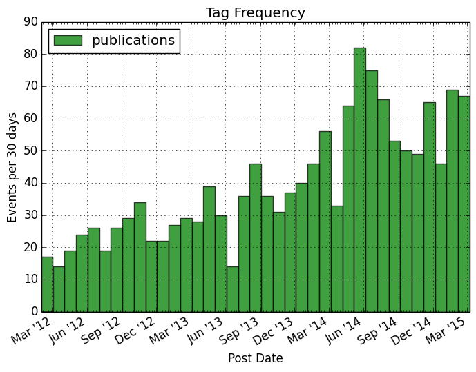
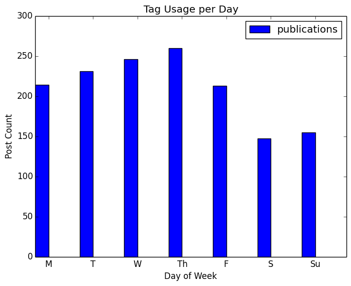

# se_analysis
## superficial analysis of stack exchange archives.

The User must download the Stack Exchange archives for these scripts to work.

The entire archive is inconveniently large and distributed by bit torrent of 
questionable reliability (as far as seeds goes). Individual sub-archives can
be downloaded and result in directories of the form "<sub-archive-name>.stackexchange.com".

https://archive.org/download/stackexchange

As an example, the archive "academia.stackexchange.com.7z" was downloaded. The 
scripts should be run in this order (after unzipping):
```
$python stack.py academia.stackexchange.com
$python make_plots.py academia.stackexchange.com
```

## Output
An example of the output is shown below. The script searches for the archive to
analyze and makes directories to store results and plots. It prints the top rank
information for users and tags based on different sorting variables. Currently
the stack exchange archives have generic placement names for users that have
been deleted. These are checked to match expected conditions, but ignored in 
ranking. At the end, the date range, approximate number of days, and total 
number of posts is displayed.  
```
$ python stack.py academia.stackexchange.com
Making results directory:
  academia.stackexchange.com/results
Making plots directory:
  academia.stackexchange.com/plots
835 invalid (no creation owner ID) posts found.

835 display (no creation owner ID) posts found.

Invalid posts should equal the number of display posts.

----
Top 10 tags based on uses:
Rank  Tag                  USES
#1    publications         1466
#2    phd                  1192
#3    graduate-admissions   958
#4    research              755
#5    graduate-school       568
#6    citations             501
#7    thesis                455
#8    journals              421
#9    masters               396
#10   teaching              379
----
Top 10 tags based on views:
Rank  Tag                 VIEWS
#1    phd                 1868875
#2    publications        1587795
#3    graduate-admissions 919144
#4    graduate-school     716333
#5    research            704389
#6    professors          630257
#7    teaching            606114
#8    ethics              584031
#9    advisor             541463
#10   etiquette           532110
----
Top 10 tags based on average:
Rank  Tag                 AVERAGE
#1    college-athletics   7895.5
#2    sexual-misconduct   6846.0
#3    introduction        6070.9
#4    credibility         5733.0
#5    cheating            5567.3
#6    answering-questions 5513.8
#7    quitting            5111.5
#8    harassment          4814.6
#9    transfer-student    4706.0
#10   titles              4314.8
----
Top 10 users based on posts:
Rank  UserID              POSTS
#1    53                    994
#2    4394                  699
#3    22733                 532
#4    929                   524
#5    2700                  469
#6    612                   437
#7    65                    343
#8    346                   342
#9    11365                 338
#10   1010                  272
----
Top 10 users based on score:
Rank  UserID              SCORE
#1    53                   8599
#2    612                  6667
#3    2700                 5510
#4    4394                 5459
#5    65                   5406
#6    11365                4905
#7    22733                4657
#8    938                  4068
#9    346                  3974
#10   929                  3751
----
Top 10 users based on average:
Rank  UserID              AVERAGE
#1    15501                25.1
#2    22000                21.7
#3    5958                 20.2
#4    948                  18.2
#5    9538                 17.2
#6    21704                16.8
#7    12047                16.8
#8    411                  16.2
#9    675                  16.2
#10   65                   15.8
----
First post: 2011-10-12 18:58:34.073000
Last post: 2015-03-08 02:57:28.520000
Archive spans approximately 1242 days, with 28323 posts.
----
```
Final plots will be saved in ./academia.stackexchange.org/plots. By default
the top 5 used tags will have associated time frequency plots and usage per day
of week plots generated. 

The plots take the following name format:
```
freq_<rank>_<tag>_tight.png
days_<rank>_<tag>_tight.png
```
The rank is an integer denoting the rank of the associated tag. The keyword 'tight'
is a superficial plotting tag, indicating margin whitespace is reduced. Example
plots are shown below.



## Brief code description

A small wrapper class was made to facilitate the xml parsing `SEPost()` (stack
exchange post), which strips down the abundance of post information to the necessary
content for these basica plots. 

A second class (`PostArchive()`) to manage the individual posts takes care of the sorting, ranking
and calculation of derived quantities like average scores with minimum view 
requirements.

The basic plotting macros are managed by a class `PlotManager()` and is mostly 
used to organize the kind of ugly matplotlib calls. 


